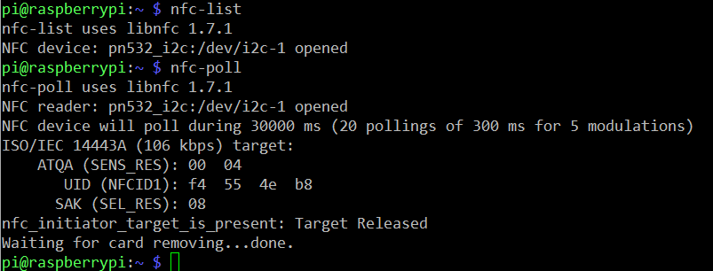

# NFC Prototype

This project is a simple prototype to use FIDO and Federation Authentication. This card reader uses NFC to communicate with a specific Android Opening Door App.

## PN532 NFC Module for Raspberry Pi 3 [^1](http://wiki.sunfounder.cc/index.php?title=PN532_NFC_Module_for_Raspberry_Pi)

*Note: If you have configured libnfc before, please delete the config file.*

	 sudo rm -rf /etc/nfc

1. Open I2C of the Raspberry Pi 
```
sudo raspi-config
```
Select *5 Interfacing Options* -> *I2C* -> *yes*.

2. Install some dependent packages
```
sudo apt-get update
sudo apt-get install git build-essential autoconf libtool libpcsclite-dev
sudo apt-get install libusb-dev libpcsclite-dev i2c-tools
```

3. Download and unzip the source code package of libnfc
```
cd ~
wget http://dl.bintray.com/nfc-tools/sources/libnfc-1.7.1.tar.bz2
tar -xf libnfc-1.7.1.tar.bz2
```

4. Compile and install
```
cd libnfc-1.7.1
./configure --prefix=/usr --sysconfdir=/etc
make
sudo make install 
```

5. Write the configuration file for NFC communication
```
cd /etc
sudo mkdir nfc
sudo nano /etc/nfc/libnfc.conf
```

Check the following details of the file etc/nfc/libnfc.conf:

```
# Allow device auto-detection (default: true)
# Note: if this auto-detection is disabled, user has to set manually a device
# configuration using file or environment variable
allow_autoscan = true

# Allow intrusive auto-detection (default: false)
# Warning: intrusive auto-detection can seriously disturb other devices
# This option is not recommended, user should prefer to add manually his device.
allow_intrusive_scan = false

# Set log level (default: error)
# Valid log levels are (in order of verbosity): 0 (none), 1 (error), 2 (info), 3 (debug)
# Note: if you compiled with --enable-debug option, the default log level is "debug"
log_level = 1

# Manually set default device (no default)
# To set a default device, you must set both name and connstring for your device
# Note: if autoscan is enabled, default device will be the first device available in device list.
device.name = "_PN532_I2c"
device.connstring = "pn532_i2c:/dev/i2c-1"
```

6. Wiring

Toggle the switch to the I2C mode

| SEL0        | SEL1        |
| ----------- | :---------: |
| H           | L           |

7. Run i2cdetect –y 1 to check whether the I2C device is recognized.

If yes, it means both the module and the wiring work well.
Then type in `nfc-list` or `nfc-poll` to check the NFC module: 




## [NFC Bindings](https://github.com/xantares/nfc-bindings)

1. Install Requirements

* libnfc >= 1.7.1 
* cmake
	```sudo apt install cmake```
* swig	
	```sudo apt-get install swig```
* python

2. Quickstart
	
	git clone https://github.com/xantares/nfc-bindings.git
	cmake -DCMAKE_INSTALL_PREFIX=~/.local .
	make install
	python python/examples/quick_start_example.py 

## NFC Prototype
	
1. Get the source code

```
	cd ~ && git clone https://github.com/I-am-Gabi/nfc-prototype.git
	cd nfc-prototype/
```

2. Change HOSTNAME and PORT values on Door lock NFC card reader's settings.py file to the IP Address and PORT where you are running the FIDO UAF Demo Server 

```	
	nano settgins.py
```

3. Run it

```
	python nfc-prototype.py
```

### References

[^1]: http://wiki.sunfounder.cc/index.php?title=PN532_NFC_Module_for_Raspberry_Pi

[1] [PN532 NFC Module for Raspberry Pi](http://wiki.sunfounder.cc/index.php?title=PN532_NFC_Module_for_Raspberry_Pi)

[2] [Setting up a PN532 NFC module on a Raspberry Pi using I2C](https://blog.stigok.com/post/setting-up-a-pn532-nfc-module-on-a-raspberry-pi-using-i2c)